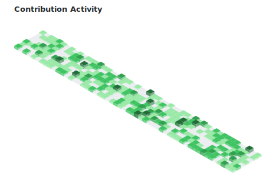

<!-- Matrix Animation Header -->

  

<h1 align="center">Hi, I'm Vusi Kunene Matlou</h1>
<h3 align="center">IT Operations Intern @ BMW Group South Africa | Cybersecurity, DevSecOps & Automation</h3>

Computer Science graduate with hands-on experience across enterprise IT Operations, Cybersecurity, DevSecOps, and Software Development — gained through internships at **BMW Group South Africa** and **TMS Dynamics**. I build automation tooling, work on IAM/access governance across global markets, and I'm actively growing into cloud security.

- 🔭 I'm currently **supporting IT Operations, IAM, and DevSecOps initiatives at BMW Group South Africa**, and building internal Python automation tooling
- 🌱 I'm currently working toward **AWS Cloud Practitioner** certification, followed by **CompTIA Security+**
- 👯 I'm looking to collaborate on **API security tooling, IAM automation, and Python-based DevSecOps utilities**
- 💬 Ask me about **Python/Java automation, API security, IAM, OWASP principles, or enterprise IT support**
- 🎓 President, Eduvos Coding Club | Vice President, Geekulcha Midrand Chapter | Golden Key Honour Society member
- 📫 How to reach me:
  - matlouvusikunene544@gmail.com
  - [linkedin.com/in/vusi-matlou](https://www.linkedin.com/in/vusi-matlou/)
  - [github.com/Vusi-Kunene-Matlou](https://github.com/Vusi-Kunene-Matlou)
- 📄 Full experience: [Resume](https://drive.google.com/file/d/1G3M1tU2R9wQPVoNQ35kYvxUxe1GgFQD2/view?usp=sharing)
- ⚡ Fun fact: **I'm passionate about ethical hacking and enjoy solving cybersecurity challenges**

### Featured Projects

**🩺 [Dermaglare](https://dermaglare.co.za)** — End-to-end dermatology ecosystem (patient app, chatbot, web portal, admin dashboard) with POPIA-compliant data handling. *Flutter, Firebase, React.js, Next.js, Node.js, Firestore, Cloud Functions*

**🔐 [API Security Scanner](https://github.com/Vusi-Kunene-Matlou/API-SECURITY-SCANNER)** — Automated vulnerability scanner covering SQL Injection, XSS, CSRF, directory traversal, and auth bypass, with structured audit-ready reporting. *Python, RESTful APIs, Security Testing*

**🌍 UBUNTU Verse** — G20 VR tourism platform showcasing South Africa's rural destinations, with a content-monetization model for local youth participation in the digital economy. *Unity/Unreal, WebXR, Node.js, Firebase*

### Contribution Activity

<picture>
  <source media="(prefers-color-scheme: dark)" srcset="output/contribs-dark.svg">
  <source media="(prefers-color-scheme: light)" srcset="output/contribs-light.svg">
  
</picture>

Auto-generated daily via GitHub Actions from live contribution data — see <code>scripts/generate_contribs.py</code>.

### Blog posts
<!-- BLOG-POST-LIST:START -->
<!-- BLOG-POST-LIST:END -->

<h3 align="left">Connect with me:</h3>

<h3 align="left">Languages and Tools:</h3>

&nbsp;
